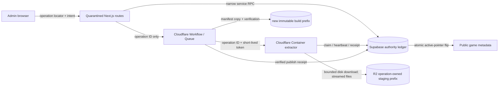

# Selected architecture

## Why this option

### A. Single Worker request

Simplest deployment, but unsuitable. It couples one invocation to archive
download, central-directory parsing, extraction, and hundreds or thousands of R2
PUTs. Request/subrequest ceilings, memory pressure, and inability to resume safely
turn partial failure into routine operational risk.

### B. Queue/Workflow with chunked Worker extraction

Durable retries and orchestration are useful, but ZIP deflate streams and central
directory access make arbitrary per-message chunking complex. Re-reading the ZIP
or persisting decompressor state increases R2 reads, state size, and correctness
risk. Use Workflow/Queue as the control plane, not as the extraction engine.

### C. Cloudflare Container extraction — recommended

A Container can download the bounded ZIP to ephemeral disk, inspect its central
directory, and stream one file at a time to R2 with bounded memory. It naturally
handles large file counts without tying all work to a Worker request. Workflow
provides retries, leases, and cleanup orchestration. This is the simplest reliable
Cloudflare-native design for practical Unity archives.

### D. Isolated background extraction service

A managed job runner (for example a container job outside Cloudflare) has similar
disk and streaming benefits and may offer mature job controls. It adds a second
cloud trust boundary, credential distribution, egress considerations, and more
operations work. It is the fallback if Cloudflare Container runtime limits or
regional availability do not meet staging results.

## Cost and scalability notes

- Containers scale to zero and bill memory, vCPU, and disk time; the paid plan is
  required. Actual cost must be measured with representative Unity fixtures.
- Each extracted file still produces an R2 Class A write, but no single Worker
  request owns all subrequests. Publishing into an immutable prefix adds copy
  reads/writes; this is an intentional integrity cost.
- Workflow/Queue request and step costs are small relative to extraction for
  normal upload volume. Queue messages should contain operation IDs, not per-file
  payloads.
- Keep the alternative isolated job service documented until staging proves
  maximum ZIP size, extraction duration, disk needs, and Container concurrency.

Official pricing references (checked 2026-07-14):

- <https://developers.cloudflare.com/containers/pricing/>
- <https://developers.cloudflare.com/workflows/reference/pricing/>
- <https://developers.cloudflare.com/queues/platform/pricing/>
- <https://developers.cloudflare.com/r2/pricing/>

